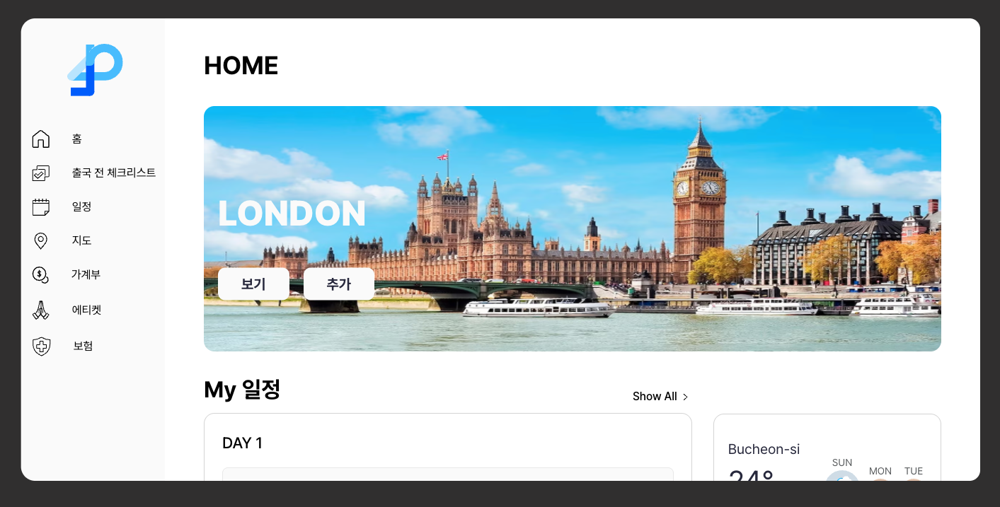
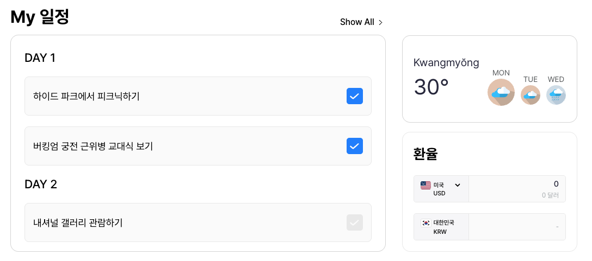
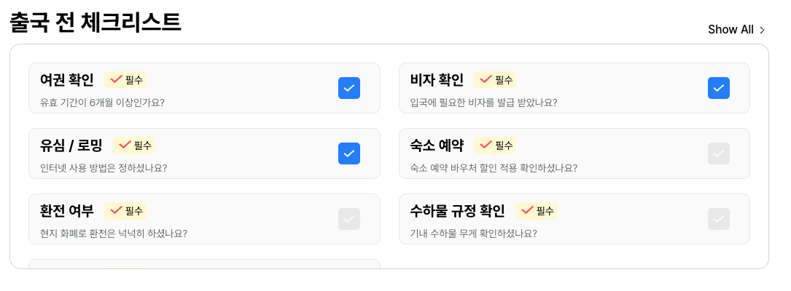
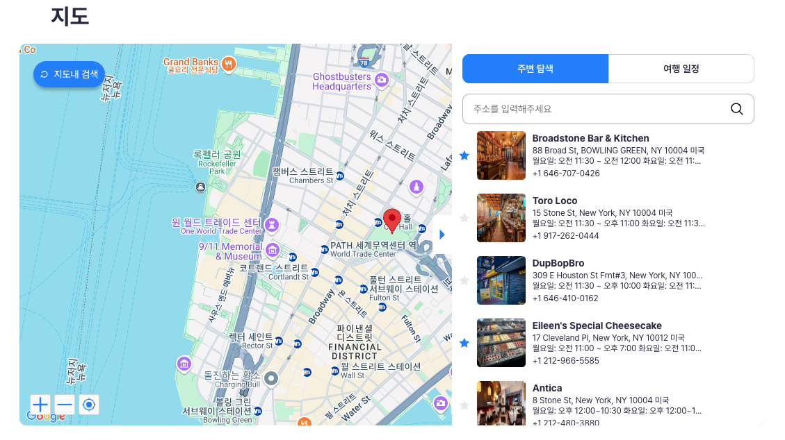
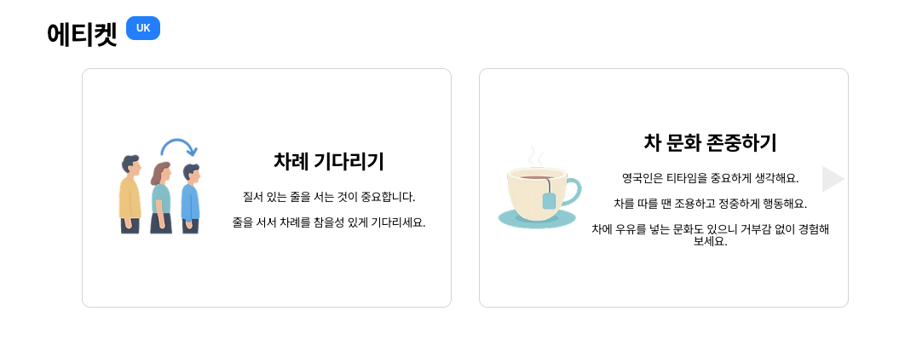
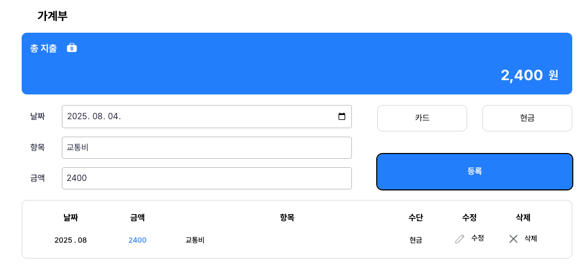

# 🍿 Welcome to Netflex

> 두둥~! 영화 같은 여행이 시작됩니다.
> "협업이 가장 중요한 팀 프로젝트.  
> 정렬되고 유연한 팀워크를 위해, 저희는 Netflex가 되었습니다."

---

**Netflex**는 단순히 '넷플릭스'를 패러디한 이름이 아닙니다.  
이번 프로젝트에서 저희는 **'협업'**을 가장 중요한 가치로 삼았고,  
그 협업이 **정렬(flex-direction)**되면서도 **유연(flexibility)**하게 작동하길 바랐습니다.

그래서 저희는 CSS의 `flex` 속성에서 아이디어를 얻어,  
팀원 4명(넷, Net)의 조화를 담은 이름 **Netflex**를 탄생시켰습니다.

---



> [넷플렉스 바로가기](https://netflex-14th.vercel.app/)

---

## 🚀 프로젝트 소개

**Netflex**는 여행을 앞둔 사람들을 위한 **정보 큐레이션 웹앱**입니다.

- ✈️ 일정 별 체크리스트와 출국 전 체크리스트
- 🌤️ 실시간 날씨 표시
- 💸 실시간 환율 반영 및 환율 계산기
- 📍 지도 기반 여행지 탐색 기능
- 🙇 나라별 에티켓 모음
- 👛 가계부

이 모든 요소를 **영화처럼 직관적이고 감각적인 UI**에 담아,  
마치 넷플릭스를 켜듯, 여행 준비도 쉽게 시작할 수 있도록 만들었습니다.

## 📅 프로젝트 기간

> 2025년 7월 18일 ~ 2025년 8월 4일

## ✨ 요약

| 요소              | 의미                                                |
| ----------------- | --------------------------------------------------- |
| 🎯 팀명 `Netflex` | Net(넷 = 팀원 4명) + flex(CSS 속성, 유연한 협업)    |
| 🧠 핵심 컨셉      | 정렬된 팀워크 + 콘텐츠 큐레이션 느낌의 여행 정보 앱 |
| 🎨 UI 컨셉        | 넷플릭스나 스포티파이처럼 몰입감 있는 웹앱 형식     |

---

## 🧑🏻‍💻 팀원 소개

| 이름   | 역할    | GitHub                                      | 주요 담당                                           |
| ------ | ------- | ------------------------------------------- | --------------------------------------------------- |
| 정우진 | PL / FE | [@wjinss](https://github.com/wjinss)        | UI 기획, 지도 컴포넌트, 메인 페이지 통합, 문서 작성 |
| 장효정 | PM / FE | [@wjjhhj0914](https://github.com/wjhhj0914) | UI 기획, 일정 및 체크리스트 컴포넌트, 문서 작성     |
| 허시온 | FE      | [@HeoSion](https://github.com/HeoSion)      | UI 기획, 환율 및 날씨 컴포넌트, 문서 작성           |
| 홍민영 | FE      | [@min830-a](https://github.com/min830-a)    | UI 기획, 에티켓 및 가계부 컴포넌트, 발표            |

---

## 🛠 기술 스택

| 구분                  | 내용                                                                                                                                                                                                                                                                                                                                          |
| --------------------- | --------------------------------------------------------------------------------------------------------------------------------------------------------------------------------------------------------------------------------------------------------------------------------------------------------------------------------------------- |
| **언어**              |    |
| **개발 환경**         |                                                                                        |
| **형상관리**          |                                                                                                                                |
| **디자인**            |                                                                                                                                                                                                                                      |
| **커뮤니케이션**      |                                                                                                                    |
| **배포**              |                                                                                                                                                                                                                                   |
| **패키지/라이브러리** |                     |

## 📌 API

| API 이름                       | 내용                                           | 문서                                                                                                     |
| ------------------------------ | ---------------------------------------------- | -------------------------------------------------------------------------------------------------------- |
| **Google Maps JavaScript API** | 기본 지도 생성 및 사용자 위치 기반 렌더링      | [공식문서](https://developers.google.com/maps/documentation/javascript/overview?hl=ko)                   |
| **Advanced Marker Element**    | 지도 위에 마커 표시                            | [공식문서](https://developers.google.com/maps/documentation/javascript/reference/advanced-markers?hl=ko) |
| **Geolocation API**            | 사용자의 현재 위치 가져오기                    | [공식문서](https://developers.google.com/maps/documentation/geolocation/overview?hl=ko)                  |
| **Places Photo Object**        | 검색된 장소의 사진 URL 추출                    | [공식문서](https://developers.google.com/maps/documentation/places/android-sdk/place-photos?hl=ko)       |
| **Places API**                 | 키워드 기반 장소 검색, 장소 상세 정보 가져오기 | [공식문서](https://developers.google.com/maps/documentation/places/web-service/overview?hl=ko)           |
| **Exchange Rates API**         | 실시간 환율 정보 제공                          | [공식문서](https://exchangeratesapi.io/documentation)                                                    |
| **OpenWeatherMap API**         | 실시간 날씨 정보 제공                          | [공식문서](https://openweathermap.org/guide)                                                             |

---

## 🧩컴포넌트

### 추천 배너

사용자에게 여행지를 추천해주는 컴포넌트입니다.
이전 & 다음 버튼으로 항목을 탐색할 수 있으며, 버튼을 누르지 않으면 3.5초 후 자동으로 전환됩니다


### 일정 별 체크리스트, 날씨, 환율

일정 별 체크리스트

- 사용자가 여행 일정을 날짜별로 확인하고, 각 일정의 완료 여부를 체크할 수 있도록 구현한
  컴포넌트입니다.

날씨

- 현재 사용자의 위치를 기반으로, 실시간으로 3일 동안 날씨의 정보를 시각적으로 확인할 수 있는 컴포넌트입니다.

환율

- 미국, 영국, 유로, 일본 4개의 통화를 원화로 변환해주는 컴포넌트 입니다.
  실시간 환율 데이터를 활용하여 자동 계산됩니다.



### 출국 전 체크리스트

사용자가 비행 전 준비해야 할 항목들을 한 눈에 확인하고, 완료 여부를 체크할 수 있도록 구성된 컴포넌트입니다.
체크한 항목은 localStorage에 저장되어 새로고침 후에도 유지됩니다.



### 지도

사용자에게 현위치를 기반으로 검색 서비르를 제공하는 컴포넌트입니다.
검색 결과를 저장 및 삭제할 수 있으며, "지도 내 검색" 기능을 통해 "근처 맛집"을 검색할 수 있습니다.



### 에티켓

각 나라별 에티켓을 보여주는 컴포넌트입니다.
상단의 배지를 클릭해 나라를 변경할 수 있으며, 이전 & 다음 버튼으로 항목을 볼 수 있는 컴포넌트입니다.



### 가계부

사용자가 여행 중 사용한 금액을 기록할 수 있는 컴포넌트입니다.
날짜, 항목, 금액, 카드 사용 여부 등을 설정할 수 있으며, 저장한 내역은 수정 및 삭제가 가능합니다.



---

## 🏗️ 프로젝트 설치 방법

```
git clone https://github.com/FRONTENDBOOTCAMP-14th/NETFLEX.git
cd NETFLEX
npm install
npm run dev
```

---

## 📁 프로젝트 폴더 구조

```
📦 Netflex (프로젝트 루트)
├── 📁 public
│   └── assets                     # 정적 이미지 및 SVG 파일
├── 📁 src                         # 소스 코드 디렉토리
│   ├── 📁 components              # 각종 UI 컴포넌트 (지도, 날씨, 일정 등)
│   ├── 📁 pages                   # 서브 페이지 구성 (지도 페이지 등)
│   ├── 📁 styles                  # 전체 공통 스타일과 모듈 스타일
│   ├── 📁 utils
│   └── main.js
├── .env                           # 환경 변수 설정 파일
├── .gitignore
├── .prettierrc
├── eslint.config.js
├── index.html                     # 메인 페이지
├── package.json
├── package-lock.json
├── README.md
└── vite.config.js                 # Vite 빌드 도구 설정 파일

```

---

## 📖 문서 보기

- 📚 [GitHub Wiki 바로가기](https://github.com/FRONTENDBOOTCAMP-14th/js-project-team-2/wiki)

- 📘 [넷플렉스 노션 바로가기](https://www.notion.so/Netflex-23473873401a803d8e2fe9b300e2bafe)

- 🎨 [Figma 시안 보기](https://www.figma.com/design/HXGNDMW4UHR7FoK3R1mt2Q/%EB%B0%94%EB%8B%90%EB%9D%BC-%ED%94%84%EB%A1%9C%EC%A0%9D%ED%8A%B8--2%EC%A1%B0?node-id=114-354&p=f&t=MEFCvQYAGngGbl5Y-0)
